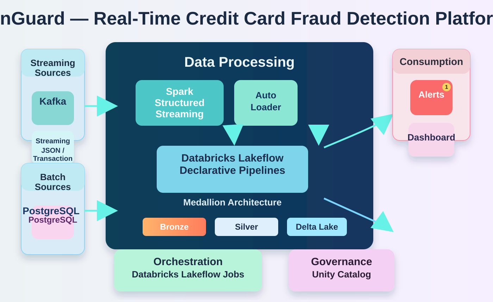

# FinGuard — Real-Time Credit Card Fraud Detection Platform

FinGuard is a real-time fraud detection platform that combines Kafka-based transaction streaming, Databricks medallion processing, and alerting to detect suspicious payment activity as it happens.

<p align="center">
  
</p>

## Overview

The platform models a modern data pipeline for financial fraud prevention:

- Streaming transaction data is generated from producers and sent through Kafka.
- Data is ingested and transformed using a Databricks Lakehouse architecture.
- Fraud rules are applied in bronze, silver, and gold layers.
- Risky transactions trigger alerts and monitoring dashboards.
- Governance and lineage are managed with Unity Catalog and controlled deployment workflows.

## Key Features

- Real-time credit card transaction simulation
- Kafka ingestion for high-throughput event streams
- Databricks structured streaming with a medallion architecture
- Fraud watchlist matching and rule-based risk scoring
- High-value and card-based fraud alert notifications
- Gold-layer dashboards and operational monitoring
- Secure configuration and secret-driven access patterns

## Architecture

The project is split into two major parts:

1. Kafka producer layer
   - Generates realistic customer, merchant, and transaction data
   - Simulates normal and fraudulent activity
   - Publishes JSON payloads to a Kafka topic

2. Databricks streaming pipeline
   - Reads Kafka topic data in the bronze layer
   - Cleans and enriches records in silver tables
   - Acts on fraud patterns in gold tables
   - Sends real-time alerts and updates downstream systems

## Repository Structure

```text
FinGuard/
├── README.md
├── assets/
│   └── finGuard-architecture.svg
├── FinGuard/                  # Python virtual environment
├── kafka_producer/            # Transaction generator and Kafka integration
│   ├── config.py
│   ├── consumer.py
│   ├── customer_generator.py
│   ├── data/
│   ├── fraud_engine.py
│   ├── merchant_generator.py
│   ├── models.py
│   ├── producer_fraud_card.py
│   ├── producer_fraud_transaction.py
│   ├── producer_normal.py
│   ├── requirements.txt
│   ├── transaction_generator.py
│   ├── update_csv_email.py
│   └── utils.py
├── finguard_project/
│   ├── manifest.mf
│   └── finguard_project/
│       ├── 01_kafka_streaming_test.py
│       ├── 02_Setup_Secret_Scope.py.py
│       ├── Autoloader_test.py.py
│       ├── fraud_watchlist_file_generator/
│       └── finguard_streaming/
│           ├── alert/
│           ├── bronze/
│           ├── gold/
│           └── silver/
└── .git/
```

## Getting Started

### Prerequisites

- Python 3.10+
- Kafka access credentials or a local test cluster
- Databricks workspace access for streaming pipeline deployment
- Optional: Gmail SMTP credentials for alerting

### 1. Activate the environment

If you are using the included environment:

```bash
source FinGuard/bin/activate
```

Or create your own local environment:

```bash
python3 -m venv .venv
source .venv/bin/activate
```

### 2. Install dependencies

```bash
cd kafka_producer
pip install -r requirements.txt
```

### 3. Configure Kafka settings

Create a `.env` file in the `kafka_producer` folder with values similar to:

```env
BOOTSTRAP_SERVERS=your-bootstrap-servers:9092
API_KEY=your_api_key
API_SECRET=your_api_secret
TOPIC_NAME=credit_card_transactions
TRANSACTIONS_PER_SECOND=5
FRAUD_PERCENTAGE=0.08
TOTAL_CUSTOMERS=1000
TOTAL_MERCHANTS=200
RANDOM_SEED=42
```

### 4. Run the producer

```bash
cd kafka_producer
python producer_normal.py
```

You can also run specialized fraud producers:

```bash
python producer_fraud_transaction.py
python producer_fraud_card.py
```

## Streaming Pipeline Components

The pipeline under `finguard_project/finguard_project/finguard_streaming` includes:

- `bronze/` for raw Kafka or Auto Loader ingestion
- `silver/` for cleansing, enrichment, and deduplication
- `gold/` for alerting logic and aggregate metrics
- `alert/` for email notifications and downstream actions

Examples of implemented logic include:

- fraud watchlist matching
- transaction velocity detection
- high-value transaction alerting
- golden table aggregation by minute
- email notifications for suspicious activity

## Notes

This repository is a practical implementation of a real-time fraud monitoring design using Kafka, Spark Structured Streaming, and Databricks Lakehouse components. It is well suited for demonstration, proof-of-concept, and learning scenarios.

## License

This project is intended for educational and demonstration purposes. Update the license if you plan to publish or distribute it externally.
